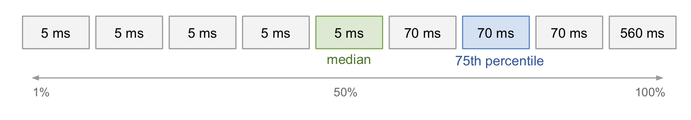
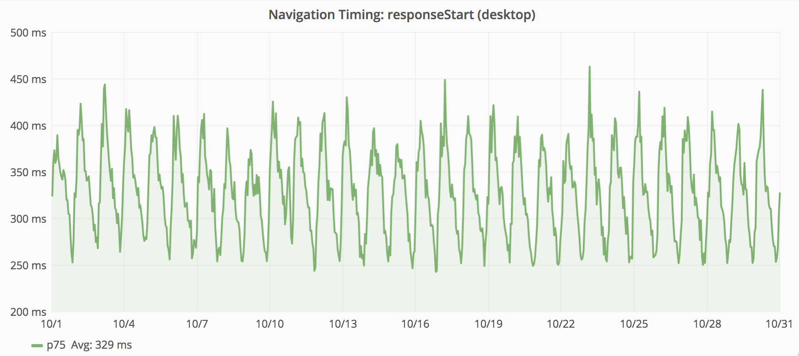
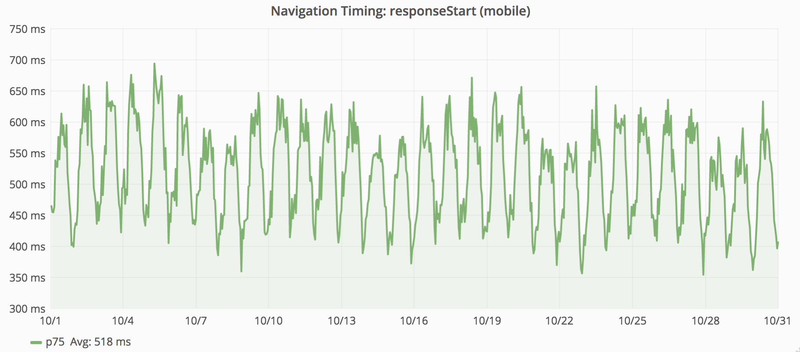
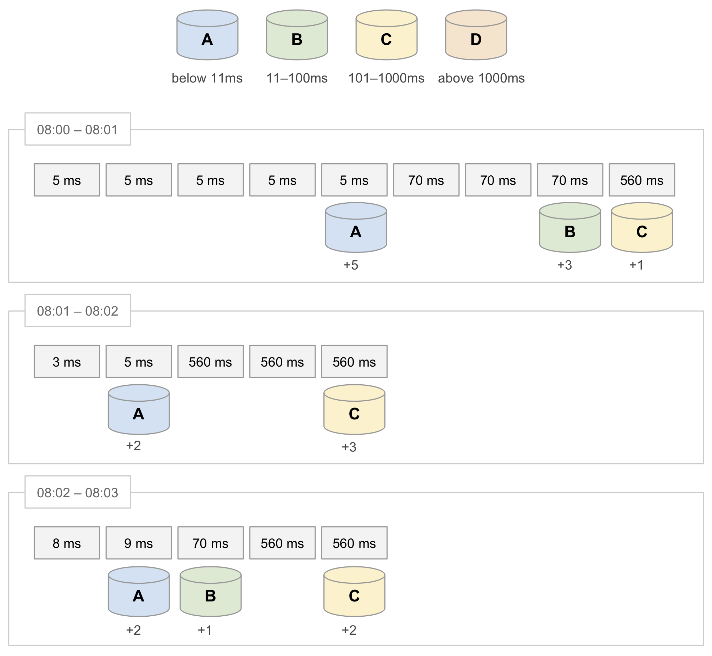
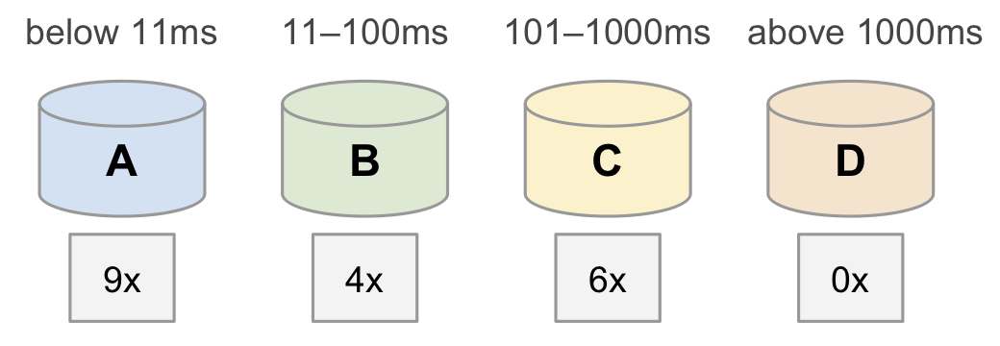
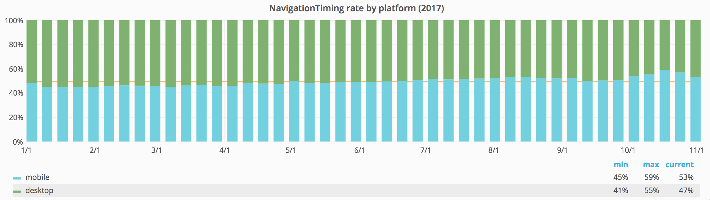

# 【译】衡量维基百科的加载时间
> 原文地址：[Measuring Wikipedia page load times](https://calendar.perfplanet.com/2018/measuring-wikipedia-page-load-times/)
> 原文作者：[Timo Tijhof](https://timotijhof.net/)
> 译文出自：[FE-star/speed](https://github.com/FE-star/speed)
> 译者： [graceapple](https://github.com/graceapple)

本文展示了如何衡量和解读维基百科的加载时间，解释了实际用户指标是什么以及百分位数的工作方式

## 导航计时(Navigation Timing)

浏览器加载一个页面时，页面中是可以包含程序（JavaScript）的。这个程序将在浏览器内部与页面一起运行，使页面具有动态变化的能力，而不仅仅是静态文本和图片。在维基百科首页搜索时出现的建议就是由JavaScript实现的。

浏览器允许JavaScript访问某些内部系统。其中一个是导航计时，它记录每一步的耗时。例如
- 和服务器建立连接的时间
- 服务器响应何时到达
- 浏览器何时完成页面加载

## 测量点：真实用户和综合测试

有两种衡量performance的方式： 真实用户监测和综合测试。对于理解性能和监测变化都很重要

综合测试可以提高变化检测的可信度。为了检测变化，我们用自动化机制持续加载页面并提取结果（例如加载时间）。如果结果之间存在差异，则可能意味着这个网站发生了变化。但这是基于其他影响因素都是常量的假设基础上，诸如网络延时，操作系统，浏览器版本等等。

这样很容易看到相对变化，但综合测试无法衡量用户所感知的性能。为此，我们需要从用户浏览器中收集数据。

我们通过js代码读取浏览器端navigation timing的数据，再把它们发送回wikipedia.org，是为真实用户测试。

## 如何衡量：百分位数

假设，有九个用户，每人发送一个请求：5人在5ms内收到响应，3人在70ms得到响应，最后一个耗时560ms才收到响应。平均值是88ms，但这个值并不能反应任何人的实际情况。所以，我们来看看百分位数法。

响应时间从低到高排序，前半部分后的第一个值（或是正中间的值）称为中位数（第50个百分位数）。本例中，中位数是5ms。前75%数据后的第一个值是70ms（第75个百分位数），我们可以说“对于75%的用户，服务在70ms内响应”。显然，这个结果更合理。

面对一个百万级用户的服务时，我们一般关注的是第99个百分位数和最高值（第100个百分位数）。使用中位数或者任何低于99%的中位数，都会排除大量用户。如果1%的请求有问题，以及是严重问题了。需要注意的是，%1的请求不只是意味着1%的页面浏览量或者1%的用户。

浏览一个典型的维基百科页面，会向服务器发送20个请求（1 document，3stylesheets，4scripts，12 images）。而一般来说，一个用户在他的会话有效期内平均会访问3个页面。

这意味着我们这1%的请求可能会影响到20%的页面综合浏览量（20 request \* %1 = 20% = 1/5）和60%的用户（3pages\*20request\*1%=60% = 2/3）.更糟糕的是，如果这个问题持续一段时间，每个用户都可能至少会遇到一次问题。就像掷骰子一样，虽然掷到6的概率是1/6,但是大家一直掷，最终每个人都会掷到6的。

## 真实用户变量

前面重点介绍了服务器内部的性能测试。属于服务端测试，始于收到请求，终于发出请求。在这种情况下，我们的服务器是后端，用户设备为前端。

然而请求从用户设备发送到我们的系统也是需要时间的（例如经过蜂窝网络，wifi或者有线），同样，服务器的响应也要经过类似的网络才能到达用户设备，还要加上操作系统和浏览器处理并显示的时间。这一部分属于前端性能测试。

不同于后端性能可能影响所有用户。影响前端性能的因素更加不可控，例如网络质量，设备处理能力，浏览器，浏览器版本等等。

即使后台服务没有任何变化，前端性能都不尽相同。可能受到如下影响：
- **网络.** 运营商可以改变网络性能，老用户可能会换运营商，新用户上线来也会造成运营商之间比例变化。
- **设备.** 操作系统和浏览器的更新都会影响页面加载性能。老用户可能会换个浏览器。新用户可能会使用更新的设备和浏览器。
- **内容变更.** 特别对于维基百科，页面随时可能被编辑。
- **内容选择.**  新闻和社交媒体的热点都会带来不同页面的流量变化
- **设备选择.**  用户在不同场景下可能会使用不同设备浏览（相同的）内容

当然，导致性能突变的最优可能的原因的还是我们自己。鉴于我们的规模，上述影响因素通常只可能同时作用到很少量的用户上，或是性能变化缓慢发生。

然而，有时这些外部因素也会对性能造成明显的影响。

## 举个例子：Mobile Safari 9

Apple 2015年发布IOS9后不久，我们的全球测试结果比以前更高。我们发现这是由于Mobile Safari 9 引入了对Navigation Timing的支持。

在这之前，我们的数据指标只能代表安卓用户，而在IOS9后，我们又增加了对Mobile Safari的测试。

而对比安卓用户，IOS9用户并没有感到显著地快或慢。IOS升级影响了我们的指标，因为我们在测试时把那些Mobile Safari用户包含了进来。

桌面延时为330ms左右，而移动端延时则为520ms左右。从移动端获得的数据更多，最终结果就更偏向移动端表现。

 

上图分别为桌面端和移动端响应启动的第75个百分位数（2015年11月）。我们把这些指标组合成每分钟一个数据点，共一个月的数据。由于尺寸所限，图上一个点表示三个小时。这个点是对每个三小时时间段内的每分钟的数据取平均值。粗略看来，上图似乎并不如描述一般显示的是2015年11月的第75个百分位数。原因下一节会解释。

## 百分位数的平均值

意见取决于随着时间推移取百分位数的平均值效果好坏。但有一点很明确：很多个一分钟的百分位数的平均值并不能代表这些分钟的百分位数。每分钟都不同，并且每分钟内的值的数量也不同。要获取一个小时的百分位数，我们需要取这个小时内所有的值，而不是每分钟百分位数的汇总。

举个例子，下面是三分钟以内的所有数据。每个值是一个请求的响应时间。每分钟内，按照响应时间从低到高排列。

这三个独立的中位数的平均值是211ms，由（5+560+70）/3得到。而实际上这些数据总的中位数是70ms。

## 存储桶

要计算很长一段时间段内的百分位数，需要所有的原始数据。但是，长期存储每次维基百科页面的访问数据效率着实不高，我们也无法很快算出中位数。

另一种方法是用存储桶来汇总数据。我们为每个区间创建一个存储桶。当处理时间值时，只是增加对应桶的计数器。这也叫做直方图箱。

我们再来处理上面例子中的数据，这次用存储桶。

基于总计数（19），可以得出中位数（第十个）在桶B中。落在桶B中的是排在第10-第13的响应时间。以此类推，第75个百分位数（第15个值）肯定在桶C中，因为桶c中的响应时间排在第14-第19.

我们得出的中位数虽然无法精确到毫秒，但是可以肯定中位数在11ms-100ms之间。（这也与我们之前的计算吻合，中位数是70ms）

当我们使用精确的百分位数时，目的是使这个百分位数达到某个特定的目标值。例如，如果今天我们的第75百分位数是560ms，这意味着75%的用户响应时间等于或低于560ms。那么我们的目标可以设为将第75个百分位数降低到500ms以内。

而用存储桶进行统计时，目标的定义就不同了。在上例中，6/19（32%）的响应时间在100ms以上（桶C和D）， 13/19（68%）的响应时间在100ms以下（桶A和B）。我们的目标可以是降低耗时100ms以上的响应的占比，或者，反过来说，提升响应时间在100ms以下的请求占比。

## 移动端的崛起

流量的趋势是越来越倾向于移动端的。事实上，2017年四月是维基百科的移动端访问量占比总访问量50%的第一个月。并且在此之后的2017年6月，移动端流量一直占比50%以上。

这样的全球化的变化，对我们的性能测量有很大的影响。驱动着我们重新思考如何衡量性能，（更重要的是）我们应该监测什么。

## 进阶阅读

- [性能指标，dashboard，分析工具概述](https://performance.wikimedia.org)
- [Navigation Timing 2级](https://www.w3.org/TR/navigation-timing-2/)，W3C规范
- [如何不测量延迟](https://www.infoq.com/presentations/latency-response-time), Gil Tene的技术讲座
- [DNS如何工作](https://howdns.works/), 一篇解释计算机如何使用域名的漫画
- 维基百科的[TCP](https://en.wikipedia.org/wiki/Transmission_Control_Protocol)
- 维基百科的[HTTPS](https://en.wikipedia.org/wiki/HTTPS)