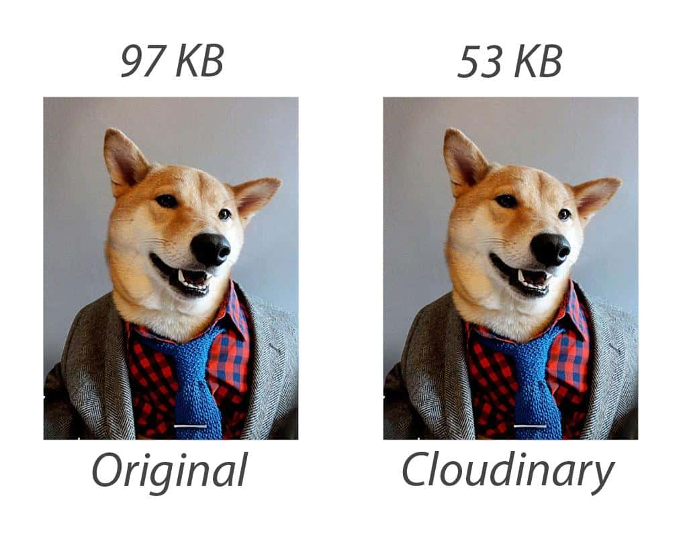

# 【译】基于浏览器、网络连接和设备存储来动态调整资源

> 原文地址：[Dynamically adjusting resources based on browser, network connection and device memory](https://calendar.perfplanet.com/2018/dynamic-resources-browser-network-device-memory/)  
> 原文作者：[Dean Hume](https://deanhume.com/)  
> 译文出自：[FE-star/speed](https://github.com/FE-star/speed)  
> 译者：[Alex Shan](https://github.com/AlexShan2008)  
> 校对者：[]  
> 本文链接：[]  

在永无止境的追求建立最快的网站的过程中，我一直在寻找奇技淫巧的方法来将最轻和最优的资源返回到我的网页。 作为Web开发人员，归因于今天浏览器的强大功能让我们从未如此幸运。 我们能够根据浏览器，设备内存甚至网络连接定制返回给用户的资源。

问题是，对大型代码库进行重大更改可能很困难。 让我们面对现实吧，每当新技术出现时，完全彻底检查你的代码虽然会很好，但实际上它需要很长时间而且通常永远无法完成。 这是 `service worker` 的优点。 它们允许我们拦截网络请求并修改响应 - 针对这种情况是完美的。 如果您不熟悉 `service worker` 的基础知识，我建议您阅读[以下文章](https://developers.google.com/web/ilt/pwa/introduction-to-service-worker)。 在本文中，我将向您展示我如何使用 `service worker` 返回给定浏览器，设备和网络连接的最佳映像。

---

## 性能对比

我不得不承认，有时候我可能会有点懒惰。 在优化图像方面，我经常喜欢使用基于云的图像管理解决方案，例如Cloudinary，它可以完成所有的工作。 想象一下，您的网站上有一个JPG图像，您只需将其指向Cloudinary，它将动态优化它并以最佳格式为您的浏览器返回一个轻量级的图像版本（想想WebP，JPEGXR，JP2000） 等）。 在Web性能方面，这使得希望从大量图像中获得最佳效果的Web开发人员的工作变得更加轻松。

在我们进一步讨论之前，值得指出的是，图片的差异已经被优化了，并且已经返回了适合你浏览器的[最佳格式](https://calendar.perfplanet.com/2014/images-are-king-an-image-optimization-checklist-for-everyone-in-your-organization/)。 让我们比较下面的两张图片。



左侧的图像是原始JPEG，大约为97 KB。 右侧的图像已经过优化，输入为53 KB。 这可以节省44 KB的图像！

值得指出的是，图像已由Cloudinary优化并作为[WebP图像](https://developers.google.com/speed/webp/)返回。 这种优化的图像在不影响视觉保真度的情况下降低了质量指数。 想象一下，这可能会给整个充满图像的网页带来不同。

在我的示例中，我想从以下内容重写我的URL：

```html

```

要更新并将其指向：

```html

```

这将返回最佳图像和格式。 问题是，这完全符合我的要求，但我真的不想更新我网站的所有部分。 这是 `service worker` 完美的解决方案！

## 入门

考虑到所有这些，让我们想象一个带有单个图像的网页。

```html


<script>
// Register the service worker
if ('serviceWorker' in navigator) {
  navigator.serviceWorker.register('./service-worker.js').then(function(registration) {
    // Registration was successful
    console.log('ServiceWorker registration successful with scope: ', registration.scope);
  }).catch(function(err) {
    // registration failed 🙁
    console.log('ServiceWorker registration failed: ', err);
  });
}
</script>
```

这将生成一个看起来有点像这样的网页。


我们使用默认注册码为页面注册了 `service worker` 。 接下来，我们需要创建一个文件并将其命名为 `service-worker.js` -- 这是我们的 `service worker` 代码所在的位置。

让我们更新 `service worker` 代码以使用fetch事件并检查当前请求是否适用于图像。

```javascript
self.addEventListener('fetch', event => {
  // Check if the request is for an image
  if (/\.jpg$|.png$|.gif$/.test(event.request.url)) {
    
    const cloudinaryUrl = `https://res.cloudinary.com/hume/image/fetch/q_auto,f_auto/${imageUrl}`;
    
    const fetchPromise = fetch(cloudinaryUrl);

    // Try and fetch the image / timeout if too slow
    event.respondWith(fetchPromise);
  }
});
```

在上面的代码中，我们检查当前请求是否针对图像，如果是，则更新URL。 这将截取请求并返回优化的图像，该图像应更轻，更高效。 这意味着 `service worker` 完成了所有艰苦的工作，我们不需要在我们的网站上更新HTML。

**上面的代码很棒，但我希望通过包括以下内容来进一步使其更加健壮：**
- 处理任何超时的能力
- 用于处理可能发生的任何网络错误的逻辑
- 如果出现任何问题，可以回退到原始图像请求

让我们更新代码以考虑到这一点。

```javascript
"use strict";

/**
 * Fetch the image from Cloudinary and
 * fail if there are any errors.
 * @param {string} imageUrl
 */
function fetchNewImageUrl(imageUrl) {

   const controller = new AbortController();
   const signal = controller.signal;

   // Build up the Cloudinary URL
   const cloudinaryUrl = `https://res.cloudinary.com/hume/image/fetch/q_auto,f_auto/${imageUrl}`;

   const fetchPromise = fetch(cloudinaryUrl, { signal });

   // 5 second timeout
   const timeoutId = setTimeout(() => controller.abort(), 5000);

   return fetchPromise
       .then(response => {
           if (!response.ok) {
               // We failed return original image
               return fetch(imageUrl);
           }
           return response;
       })
       .catch(error => {
           // Something went wrong, return original image
          return fetch(imageUrl);
       });
}

self.addEventListener('fetch', event => {

   // Check if the request is for an image
   if (/\.jpg$|.png$|.gif$/.test(event.request.url)) {

       // Try and fetch the image / timeout if too slow
       event.respondWith(fetchNewImageUrl(event.request.url));
   }
});
```

哇 - 这看起来有些复杂！ 让我们分解一下吧。

在上面的代码中，我创建了一个名为 `fetchNewImageUrl()` 的函数，它接收当前图像请求的URL。 接下来，我想确保我可以强制请求超时，如果它需要太长时间。 如果发生这种情况，我们想要获取原始图像。

最后，我们添加了一个事件监听器，它接入 `fetch` 事件，检查当前请求是否用于图像，如果是 - 它将调用 `fetchNewImageUrl()` 并根据当前为用户返回最佳图像给浏览器。

## 高级使用保存数据，设备内存和连接类型

如果要针对移动设备优化网站，请务必考虑设备内存，连接类型甚至可能启用的任何[数据保存设置](https://calendar.perfplanet.com/2018/data-shaver-strategies/)等内容。 例如，假设您站点的用户位于只有2G连接的低端设备上 -- 在这种情况下，最好返回最适合其设备和连接类型的低质量图像。

信不信由你，这些信息实际上可供我们作为开发人员使用。 使用我从[Colin Bendell](https://www.bendell.ca/)那里学到的奇淫技巧，让我们可以利用这些信息并返回尽可能轻量级的图像。

```javascript
function shouldReturnLowQuality(request){
   if ( (request.headers.get('save-data')) // Save Data is on
     || (navigator.connection.effectiveType.match(/2g/)) // Looks like a 2G connection
     || (navigator.deviceMemory < 1) // We have less than 1G of RAM
   ){
     return true;
   }

   return false;
}
```

在上面的函数中，我们正在检查有关用户设备及其网络连接的许多详细信息。 我们可以通过检查 ***navigator.connection.effectiveType*** 和 ***navigator.deviceMemory*** 来确定它们的网络连接和设备上的当前内存。 如果您想更详细地了解 [navigator.connectionType](https://deanhume.com/dynamic-resources-using-the-network-information-api-and-service-workers/) 和 `service worker` ，我建议您阅读本文以获取更多信息。

就是这样 -- 如果我们开始在具有低内存或网络连接的设备上调用此代码，它将返回一个看起来有点像下面的图像。 我已经调低了此图片的质量，但您可以根据用户的需求进行定制。 这很棒，因为您可以尽快向用户提供完全可用的网页，从而为他们提供更好的体验。


## 总结

作为Web开发人员，我们为用户提供最佳体验非常重要。 这是否意味着为他们提供快速响应的网页，或者根据他们的设备定制他们的体验 -- 这一切都可以通过 `service worker` 和现代浏览器的力量实现。 无论您决定使用像Cloudinary这样的服务还是使用自己的服务，使用轻量级图像为用户提供服务都会对Web性能产生重大影响。

关于此代码的最好的事情是您不必更改站点上的每个链接 --  `service worker` 为您处理所有这些复杂性！ 如果您想看到这个版本的工作版本，请访问[deanhume.github.io/pwa-cloudinary](https://deanhume.github.io/pwa-cloudinary/)或者如果您想查看相关代码，请访问[github.com/deanhume/pwa-cloudinary/](https://github.com/deanhume/pwa-cloudinary)。

非常感谢[Colin Bendell](https://www.bendell.ca/)和[Robin Osborne](https://www.robinosborne.co.uk/)帮助我们审阅这篇文章！

