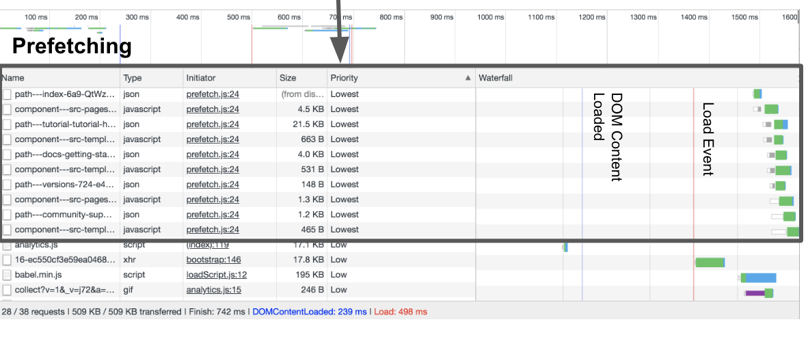
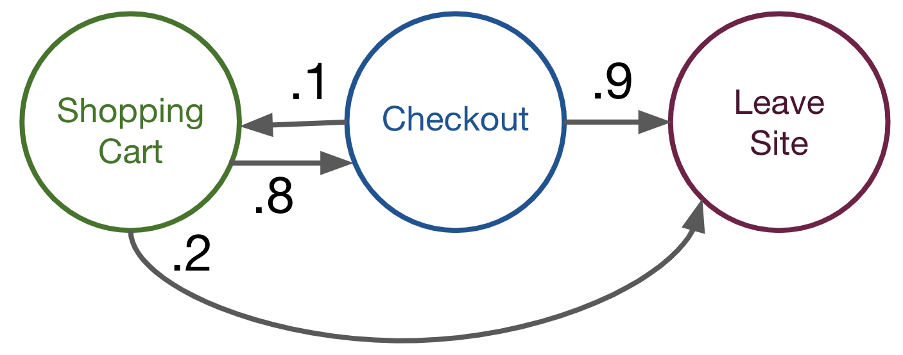
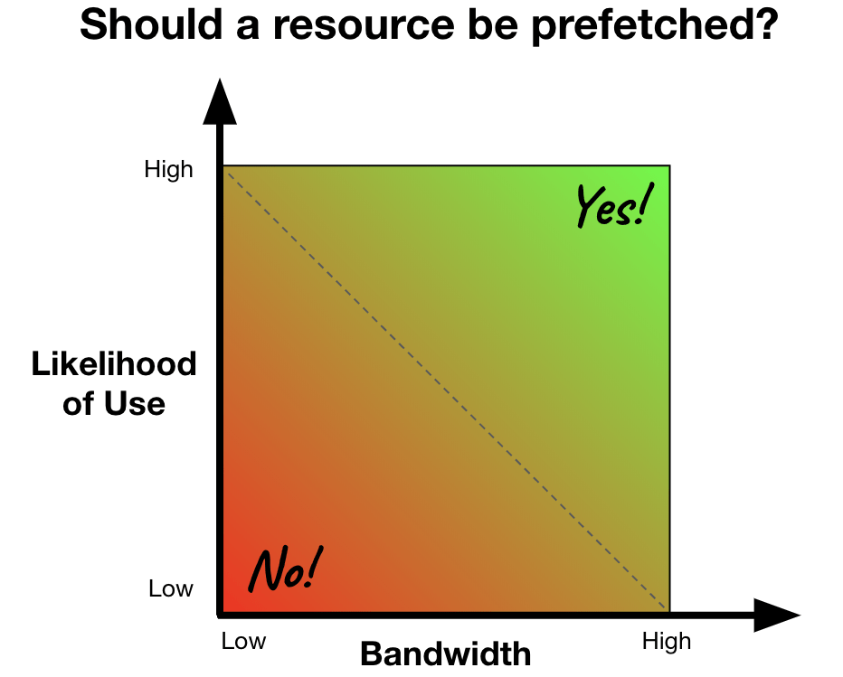
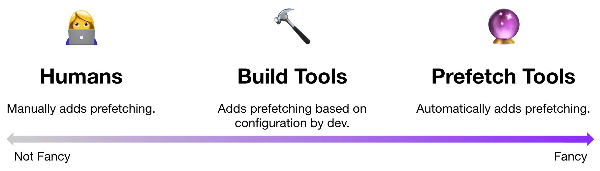

# 【译】关于 prefetching 的所有事

> 原文地址：[All about prefetching](https://calendar.perfplanet.com/2018/all-about-prefetching/)  
> 原文作者：[Katie Hempenius](https://katiehempenius.com/)  
> 译文出自：[FE-star/speed](https://github.com/FE-star/speed)  
> 译者：[kangschampagne](https://github.com/kangschampagne)  
> 校对者：[]  
> 本文链接：[]  

Prefetching(预加载) 是一种实现页面近似立即加载的技术。几十年来，这种技术一直被用于提高硬件和编译器的处理速度，但是最近，感谢于 Network Information API ([网络状况 API](https://developer.mozilla.org/en-US/docs/Web/API/Network_Information_API)) 的出现，这项技术用于加速 Web 应用程序已经变得切实可行。网络状况 API 使得开发者可以针对不同的连接类型，使用不同的预加载策略，这极大地提高了预加载的性能。本文将讲解预加载的工作原理，以及开发人员如何开始使用它。

---

## 第1部分：了解预加载
### 什么是预加载？
预加载是的一种优化策略，预测用户将来需要的资源并在真正需要使用之前下载它们。这种优化略去了下载资源的等待时间，并且可以使页面非常快速的加载。

**预加载是基于用户下一步需要什么资源的预测：** 预测越准确，预加载取也就越有效

**预加载以 “最低” 优先级获取资源：** 这样做是为了给当前页面所需的资源提供更高的优先级。如果当前页面的资源和下一页的资源以相同的优先级加载，它们将相互竞争资源（即带宽），这将损害当前页面的加载性能。


**预加载可以消除等待下载资源的情况：** 如果资源已被预加载，则在需要，它已存在于缓存中。这可以显着提高页面加载性能，特别是对于大体积资源的加载又或者是缓慢的网络连接。（注意：“prefetching”只是提前获取资源的过程。浏览器仍然需要解析，编译和执行资源才能使用。）

**预加载应该充分考虑网络条件：** 预加载的最大缺点是未使用的预取浪费资源，即带宽。因此，在决定是否使用预加载时，必须考虑网络条件。


### 预加载策略
预加载仅当预先获取的和预测应提前被获取的资源一致时才有效，即预先获取哪些资源。确定预取内容的下面有一些最常用策略：

#### 1. 交互驱动的预加载
交互驱动的预加载，是使用用户的鼠标和滚动的活动作为信号来确定要预加载的资源。例如，如果用户在遇到特定搜索结果时减慢其滚动速度，则搜索引擎可以预加载该结果的页面。

#### 2. 状态驱动的预加载
状态驱动的预加载，是使用应用程序的当前状态（通常是页面或URL）来确定要预加载的资源。例如，商店的“购物车”页面可以预加载“结帐”页面。分析数据的方式非常有助于确定用户最有可能从给定页面去访问哪个页面。这种预加载的方法是 [Markov_chain(马尔可夫链)](https://en.wikipedia.org/wiki/Markov_chain) 的现实应用。


#### 3. 用户驱动的预加载
用户驱动的预加载，是使用来自特定用户而非所有用户的信号来确定要预加载的内容。这些信号可能包括账户信息或过去网站使用情况。例如，如果社交网络注意到用户倾向于点击特定类型的文章，则他们可以在用户登录时自动预加载这些类型的文章。

#### 4. “下载所有内容” 预加载
此方法不会尝试预测用户的下一个导航，而是下载用户下一步可能需要的“所有内容”。这可以根据站点以不同方式应用：例如，预加载页面上的所有链接，或者预加载构成应用程序的所有包。

### 把它们放在一起
在实践中，这些类型的预取之间可以混合使用。没有其他理由不能在网页上应用这些技术中的一种以上。例如，日本报纸出版商 Nikkei 使用预加载的方式：

- Nikkei 为其每个文章块预加载了 “下一文章块”。例如，如果这些文章块的顺序为“经济，政治和世界”，则 “经济” 部分预加载 “政治” 部分，“政治” 部分预取 “世界” 部分。Nikkei 在关注到许多用户阅读完每个文章块的标题后都做了这一操作。
- 当用户将鼠标移近搜索按钮时，Nikkei会自动预加载搜索结果的页面。

他们通过添加这两项预加载优化，**页面加载速度提高了75％**。


## 第2部分：实现预加载
上一节讨论了预加载策略。本节讨论如何使用 prefetch resource hint 实现预加载。

### 关于 Prefetch Resource Hint
Prefetch Resource Hint 可以使预加载变得很容易。Prefetch Resource Hint 如下所示：
 
```html
<link rel="prefetch" href="/shoppingCart.html" as="document">
```

此 Resource Hint 将预加载 `shoppingCart.html`。

这就是 Prefetch Resource Hint 的工作方式：
- Prefetch Resource Hint 只能与 link 标签一起使用
- href 属性是必需的，指定预加载的资源地址
- as 属性在技​​术上是可选的，但应尽可能包含在内。这个属性告诉浏览器资源的内容类型（例如 script，document，font 等）。这有助于浏览器确定请求的优先级，设置标头，并确定资源是否已存在于缓存中
- 除 Safari 之外的所有主要浏览器都支持预取

### 使用 resource hints 的模式
通过将 Prefetch Resource Hint 与其他技术和 API 相结合，可以使 Prefetch Resource Hint 更加强大。这是两种常见的使用模式：

#### 使用客户端脚本动态添加预加载
JavaScript 可用于动态地将标签添加到文档中。由用户的鼠标或滚动操作触发的预加载是使用这项技术的示例。
当下面的脚本执行时，会在 document 中附加一个 `<link>` 标记。这会触发优先级为 “最低” 的新网络请求加入请求列队中。与任何其他网络请求一样，它将根据其优先级进行调度和执行。

```javascript
if (mouseclick) {
  const linkTag = document.createElement('link');
  linkTag.rel = 'prefetch';
  linkTag.href = 'https://www.example.com';
  linkTag.as = 'document';
  document.head.appendChild(linkTag);
}
```

注意：实际上，“最低” 优先级是**获取的预加载资源的脚本**与**使用 XHR 或 Fetch API 加载资源的脚本**之间的关键区别。如果脚本使用 [XHR](https://developer.mozilla.org/en-US/docs/Web/API/XMLHttpRequest) 或 [Fetch](https://developer.mozilla.org/en-US/docs/Web/API/Fetch_API) ，则将以 “高” 或 “最高” 优先级获取资源。因此，脚本执行后很可能会立即获取资源。如果当前页面仍在加载，则会干扰页面的加载并损害其性能。这就是为什么 Prefetch Resource Hint 是加载下一页导航所需资源的首选方法，而不是 XHR 或 Fetch。


#### 使用网络状态 API 根据网络条件调整预加载



预加载的最大缺点是未使用的预加载资源会浪费用户数据; 这对连接速度慢的用户影响最大。但是，这可以通过将用户的网络条件（通过网络状态API）的状态，合并到确定是否应该预加载资源的逻辑中来减轻消耗。
一种简单的方法是仅对快速连接又或者是极可能使用的特定资源进行预加载。

```javascript
if (window.navigator.connection.effectiveType === '4g') {
  // prefetch
} else {
  // do nothing
}
```

更复杂的方法是计算每个单独资源 “使用的可能性”。此信息与用户的连接速度相结合，用于决定资源是否应预加载。

```javascript
const connection = window.navigator.connection.effectiveType;
if ((connection === '4g' && likelihood > .25) ||
    (connection === '3g' && likelihood > .5) ||
    (connection === '2g' && likelihood > .75)) {
  // prefetch
} else {
  // do nothing
}
```

### Prefetch Tooling


#### 人工
不使用特殊工具实现预记载。手动添加 prefetch resource hints 是一种使用预加载的简单、无依赖性的方法。

#### 构建工具
Webpack 4.6.0 增加了对原生预加载的支持。原生预加载需要手动指示应该预取的资源，这很容易做到（花费 <1 行代码/资源）。旧版本的 Webpack 应该使用 [preload-webpack-plugin](https://github.com/GoogleChromeLabs/preload-webpack-plugin#resource-hints)。


#### 预加载工具
这些工具可自动构建使用预加载的许多实现细节。

##### quicklink
[quicklink](https://github.com/GoogleChromeLabs/quicklink) 是一个体积非常小的脚本（<1KB gzipped），可以自动预加载视口中的链接。默认情况下，它不会预取 2G 上的链接或启用了数据保护程序的用户。

##### Guess.js
[Guess.js](https://github.com/guess-js/guess) 包含两个使用 Google Analytics 数据实现预取的工具：
- [GuessPlugin](https://github.com/guess-js/guess/tree/master/packages/guess-webpack) 是一个Webpack插件，用于分析 Google Analytics 数据，以确定如何将应用分成不同的 bundles。当用户浏览导航应用程序时，将预加载这些包。
- [guess-static-sites](https://github.com/guess-js/guess/tree/master/experiments/guess-static-sites) 是一个工作流，用于设置预加载系统，该系统根据 Google Analytics 的数据自动添加和更新 Prefetch Resource Hint。

##### Gatsby
Gatsby 是 React 的站点生成器。Gatsby 自动预加载页面上的所有链接。[React](http://reactjs.org/) 的网站是基于 Gatsby 建站的一个例子，是从用户的角度去直接体验 prefetch 的好例子。


感谢 Yoav Weiss，Jeff Posnick，Shunya Shishido 和 Tarun Bansal 对本文的投入。