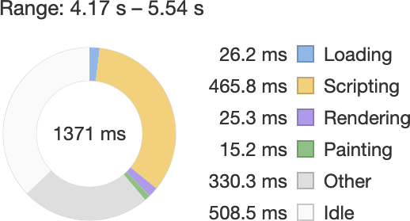
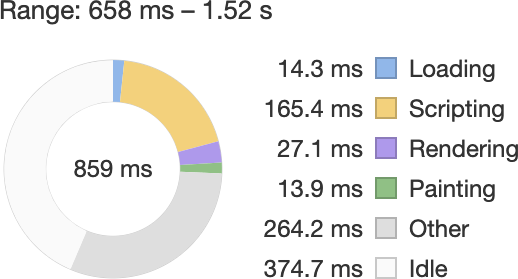

> 原文地址：[Doing Differential Serving in 2019](https://calendar.perfplanet.com/2018/doing-differential-serving-in-2019/)  
> 原文作者：[Jeremy Wagne](https://twitter.com/malchata)  
> 译文出自：[FE-star/speed](https://github.com/FE-star/speed)  
> 译者：[smallbonelu](https://github.com/smallbonelu)  
> 校对者：[]  
> 本文链接：[]  

如果你正在阅读本文，那么你可能就是那种一直在寻找务实，前瞻性思维方式来提高网站速度的人。所以，当我读了由[菲尔·沃尔顿](https://twitter.com/philwalton)写的一个被称为[差异化服务](https://philipwalton.com/articles/deploying-es2015-code-in-production-today/)的指南后，我很感兴趣。如果你还没有听说过这种技术，其实就是你可以为你的站点编译和提供两个独立的JavaScript捆绑包：

1. 一个捆绑包包含所有的Babel-fied转换和polyfills，适用于所有浏览器 - 只提供给*实际*需要它们的旧版浏览器。这可能是你已经生成的包。
2. 第二个捆绑包具有与第一个包相同的功能，但几乎没有做转换或polyfills。此包仅供可以使用它们的现代浏览器使用。

我们使用Babel来转换脚本，以便我们可以在任何地方使用它们，但是我们这样做会有一些危险。它在*大多数*配置中添加的额外代码对于现代浏览器上的用户来说通常不是必要的。通过一些努力，可以更改构建过程，以减少我们在现代浏览器上发送给大量用户的代码量，同时保持对遗留客户端（例如IE11）的兼容性。差异化服务的目的不仅仅是改善传送时间 - 这肯定对传送时间有所帮助。它还可以通过减少浏览器需要处理的脚本数量来帮助减少主线程的阻塞，这是一个资源密集型处理过程。

在本指南中，你将了解如何在2019年的构建管道中设置差异化服务，从设置Babel到你需要在webpack中进行哪些调整，以及完成所有这些工作的好处。

# 设置你的Babel配置

输出同一应用程序的多个构建版本涉及每个目标的Babel配置。毕竟，单个项目中的多个Babel配置并不罕见。通常通过将每个单独的配置对象放在`env`对象键下来完成。以下是为差异化服务设置的Babel配置中的内容：

```javascript
// babel.config.js
module.exports = {
  env: {
    // 这是我们将用于为旧版浏览器生成捆绑包的配置
    legacy: {
      presets: [
        [
          "@babel/preset-env", {
            modules: false,
            useBuiltIns: "entry",
            // 这应该合理地针对旧浏览器.
            targets: "> 0.25%, last 2 versions, Firefox ESR"
          }
        ]
      ],
      plugins: [
        "@babel/plugin-transform-runtime",
        "@babel/plugin-syntax-dynamic-import"
      ]
    },
    // 这是用来为现代浏览器生成包的配置.
    modern: {
      presets: [
        [
          "@babel/preset-env", {
            modules: false,
            targets: {
              // 这将针对支持ES模块的浏览器.
              esmodules: true
            }
          }
        ]
      ],
      plugins: [
        "@babel/plugin-transform-runtime",
        "@babel/plugin-syntax-dynamic-import"
      ]
    }
  }
};  
```

你会注意到有两种配置：`modern`和`legacy`。这些都控制着Babel如何转换每个包。讽刺的是，将polyfills并添加不必要的变换到我们的代码的工具与我们可以用来发送更少代码的是同一个工具。在Phil的原始文章中，他使用Babel 6 `babel-preset-env`来实现这一目标。现在Babel 7发布了，我改用了[`@babel/preset-env`](https://babeljs.io/docs/en/babel-preset-env)。

首先要注意的是，`@babel/preset-env`每个配置中使用的选项都不同。对于`legacy`选项，我们将browserslist查询传递给适用于旧版浏览器的[`targets`选项](https://babeljs.io/docs/en/babel-preset-env#targets)。我们也告诉preset包括来自[`@babel/polyfill`](https://babeljs.io/docs/en/babel-polyfill)与[`useBuiltIns`选项](https://babeljs.io/docs/en/babel-preset-env#usebuiltins)的polyfills。除了presets，我们还包括一些必要的插件。

**注意：**`useBuiltIns`*除了*`false`*之外还接受两个值。这些值是**[entry](https://babeljs.io/docs/en/babel-preset-env#usebuiltins-entry)**和**[usage](https://babeljs.io/docs/en/babel-preset-env#usebuiltins-entry)**。*文档很好地解释了它们的不同之处，但值得注意的是"[usage](https://babeljs.io/docs/en/babel-preset-env#usebuiltins-entry)"是实验性的。与"entry"相比**，**它通常会产生更小的包，但我发现我需要指定"entry"才能让脚本在IE 11中运行。

对于`modern`配置而言，配置看起来基本相同，除了价值`targets`不同。我使用[`esmodules`选项](https://babeljs.io/docs/en/babel-preset-env#targetsesmodules)传递一个对象，而不是传递一个browserslist查询。当设置为`true`时，`@babel/preset-env`将使用较少的转换，因为预设的目标是本机支持ES模块和`async`/ `await`或其他现代功能的浏览器。`useBuiltIns`选项也删除了，因为项目中使用的所有功能都不需要pollyfill。也就是说，如果你使用的时现代浏览器都不能很好地支持的前沿功能，你的应用程序可能需要一些polyfill。如果你的应用程序违反此设置，请进行适当地`useBuiltIns`设置。

# 配置webpack以进行差异化服务

webpack - 以及大多数其他打包工具 - 将提供一种称为*多编译器模式的功能*。此功能对于差异化服务至关重要。多编译器模式允许你传递多个配置对象的数组以吐出多组包：

```javascript
// webpack.config.js
modules.exports = [{
  // Object config one
}, {
  // Object config two
}]; 
```

这很重要，因为我们可以传递两个使用相同入口点的独立配置。我们还可以根据需要调整每个配置中的规则。

不过，这说起来容易做起来难。webpack有时非常复杂，当你处理多种配置时，没有比这更复杂的了。但是，这并非不可能，所以让我们找出实现目标所需的条件吧。

## 从常见配置开始

因为你正在对相同的入口点进行单独构建，所以你的配置将有很多共同之处。通用配置是管理这些相似性的便捷方式：

```javascript
// webpack.config.js
const commonConfig = {
  // `devMode` 是 process.env.NODE_ENV !== "production"的结果
  mode: devMode ? "development" : "production",
  entry: path.resolve(__dirname, "src", "index.js"),
  plugins: [
    // 在两种配置中常见的插件
  ]
}; 
```

从这里开始，你可以编写单独的webpack配置并使用扩展语法将常用配置合并到每个配置中：

```javascript
// webpack.config.js
const legacyConfig = {
  name: "client-legacy",
  output: path.resolve(__dirname, "src", "index.js"),
  module: {
    rules: [
      // loader...
    ]
  },
  // 使用扩展语法将常用配置合并到这个对象中.
  ...commonConfig
};

const modernConfig = {
  name: "client-modern",
  // 注意使用.mjs扩展名
  output: path.resolve(__dirname, "src", "index.mjs"),
  module: {
    rules: [
      // loader...
    ]
  },
  // 同上.
  ...commonConfig
};

module.exports = [legacyConfig, modernConfig];
```

这里要说的是，如果将两种配置之间的共同点与公共对象结合起来，可以最大限度地减少必须编写的配置行。从那里，你只关注每个目标之间的关键差异。

## 管理两种配置

既然你知道如何管理每个配置之间的*共同点*，那么你需要知道如何管理*不同的配置*。当你编译指向不同目标的公共入口点时，管理loader和插件会变得棘手。如果你处理的不仅仅是JavaScript assets，尤其如此。这是我希望会对你有所帮助的一些指导。

### `babel-loader`

可以说，你在任何webpack配置中看到的最常见的loader是[`babel-loader`](https://github.com/babel/babel-loader)。对于我们想要实现的目标，你需要在你的新版和旧版配置对象中使用`babel-loader`，尽管配置*稍有*不同。`babel-loader`对于旧版浏览器目标，配置会像下面这样：

```javascript
// webpack.config.js
const legacyConfig = {
  // ...
  module: {
    rules: [
      {
        test: /\.js$/i,
        // 确保你的第三方库打包到独立的chunk中
        // 否则这个排除模式也许会破坏你在客户端的构建
        exclude: /node_modules/i,
        use: {
          loader: "babel-loader",
          options: {
            envName: "legacy" // 指向babel.config.js中的env.legacy
          }
        }
      },
      // 其他loader...
    ]
  },
  // ...
};
```

在现代浏览器目标中，唯一的区别是我们将`test`正则表达式的值改为`/\.m?js$/i`来包含在npm包中的ES模块文件扩展名（`.mjs`）。我们还需要将`options.envName`的值修改为`"modern"`。`options.envName`指向在前面示例中`babel.config.js`中包含的单独配置。

```javascript
// webpack.config.js
const modernConfig = {
  // ...
  module: {
    rules: [
      {
        test: /\.m?js$/i,
        exclude: /node_modules/i,
        use: {
          loader: "babel-loader",
          options: {
            envName: "modern" // 指向babel.config.js中的env.modern
          }
        }
      },
      // Other loaders...
    ]
  },
  // ...
};
```

### 其他loader和插件

根据你的项目，你可能有其他loader或插件来处理JavaScript以外的assets类型。如何为每个目标浏览器处理它们取决于你的项目需求，但这里有一些建议。

- 你*可能*不需要对其他loaders进行任何更改。需要记住的是，webpack不仅可以管理JavaScript，还可以管理大量其他内容。 CSS，图像，字体，基本上每一个都需要你安装一个loader。因此，为每个目标浏览器输出相同的内容（或者至少保持对assets的相同引用）非常重要。
- 某些loaders允许你禁用文件发射。这在差异化服务构建中很有用。例如，假设你用[`file-loader`](https://webpack.js.org/loaders/file-loader/)处理导入非JavaScript资源。在现代浏览器的配置中，你可以告诉`file-loader`输出文件，而在旧版浏览器的配置中，你可以指定[emitFile：false](https://webpack.js.org/loaders/file-loader/#emitfile)以防止文件被写入磁盘两次。这*可能*有助于提高速度。
- [`null-loader`](https://github.com/webpack-contrib/null-loader) 对于使用多个配置来控制文件的加载和发送也可能是有用的。
- 小心哈希版本的assets。假设你使用图像优化加载程序（例如[`image-webpack-loader`](https://github.com/tcoopman/image-webpack-loader)）来优化图像。你可能需要在两种配置中使用该loader，因为一个assets图将包含对未优化图像的引用，另一个将包含对优化图像的引用。由于每个构建的文件内容不同，因此文件哈希也会不同。结果是一组用户将获得未优化的图像assets，而其余用户将获得优化的图像assets。
- 插件是另一个完全不同的东西，在差异化服务设置中使用它们的最佳指导方式各不相同。例如，如果你使用[`copy-webpack-plugin`](https://github.com/webpack-contrib/copy-webpack-plugin)将文件或整个目录从`src`复制到到`dist`，你只需要它在一个配置中，而不是两个。也就是说，在两种配置中使用相同的插件不会导致问题，但*可能*会影响构建速度。
- 如果你的loader和插件配置开始有点杂乱，npm脚本可以是一个很好的替代品。对于简单的项目，我经常通过npm在我的项目本地安装图像优化二进制文件（例如[`pngquant-bin`](https://www.npmjs.com/package/pngquant-bin)），并在构建完成后在npm脚本中使用[`npx`](https://medium.com/@maybekatz/introducing-npx-an-npm-package-runner-55f7d4bd282b)来完成这项工作。这减少了我的webpack配置中的混乱，这是一个让人乐于接受的改变。
- 如果你正在使用[`assets-webpack-plugin`](https://github.com/ztoben/assets-webpack-plugin)为两个版本生成assets清单，那么事情就会变得复杂。你需要创建单个实例以传递到每个配置的插件数组并[遵循此建议](https://github.com/ztoben/assets-webpack-plugin#using-in-multi-compiler-mode)。在我的一个项目中，我在Node脚本中使用`assets-webpack-plugin`将脚本引用注入到生成的HTML中（稍后会详细介绍）。

这些要点的要点是，你应该在构建之间保持assets引用的并行性，并且通常需要避免多次将相同的assets写入磁盘。但是，在可能已经很复杂的构建环境中也做了合理和方便的事情。

## 管理你的uglifier

直到最近， [uglify-js](https://github.com/mishoo/UglifyJS2)还是webpack的默认uglifier。[在4.26.0版本](https://twitter.com/wsokra/status/1064441984532848641)中[terser](https://github.com/terser-js/terser)成为了默认设置。如果你使用的是版本4.26.0或更高版本，那么对你来说是好消息 - 你已经完成所有设置，你无需再做任何额外的构建工作！

但是，如果你使用的是早期版本，则`terser`*不是* 默认的uglifier，而是`uglify-js`，你需要在你的新的配置中使用`terser`。这是因为`uglify-js`无法理解ES5之外的JavaScript语法。它无法识别像箭头函数，`async`/ `await`，等等这些东西。

对于你的旧配置，你不需要做任何事情，因为它应该已经构建好了。但是，对于你新的配置，你需要为你的项目`npm install terser-webpack-plugin`。然后你需要添加`terser-webpack-plugin`到`optimization.minimizer`数组：

```javascript
// webpack.config.js
const TerserWebpackPlugin = require("terser-webpack-plugin");

const modernConfig = {
  // ...
  optimization: {
    minimizer: [
      new TerserWebpackPlugin({
        test: /\.m?js$/i, // 如果你要输出.mjs文件，就需要这个
        terserOptions: {
          ecma: 6 // 也可以是7或8
        }
      })
    ]
  }
  // ...
};
```

在我们新的配置中，我们输出带`.mjs`扩展名的文件。为了让`terser`能够识别和修改这些文件，我们需要相应地修改`test`正则表达式。我们还需要将`ecma`选项设置为`6`（尽管`7`或`8`也是有效值）。

## 将脚本引用注入HTML

你也许使用[`html-webpack-plugin`](https://github.com/jantimon/html-webpack-plugin)来为你的应用程序外壳（app shell）标签处理生成的HTML文件，这是有充分理由的。它是一个灵活的插件，可以处理大量关于在HTML模板中插入`<link>`和`<script>`标记的繁忙工作。不幸的是，它的`<script>`标签插入方式不支持差异化服务。你可以自行决定如何将这些脚本引用添加到HTML文件中。

幸运的是，只需要稍微动动脑就可以解决这个问题。对于我使用差异化服务的项目，我使用`assets-webpack-plugin`用来收集webpack生成的assets，如下所示：

```javascript
// webpack.config.js
const AssetsWebpackPlugin = require("assets-webpack-plugin");

const assetsWebpackPluginInstance = new AssetsWebpackPlugin({
  filename: "assets.json",
  update: true,
  fileTypes: [
    "js",
    "mjs"
  ]
});
```

从这里开始，我将旧的和新的配置中的这个`assets-webpack-plugin`实例添加到`plugins`数组中。我已经使用以下配置插件实例选项来适配我的项目：

- `filename` 指示应将assets JSON文件输出到的位置。
- 我设置`update`为`true`，它告诉插件为新的和旧的配置重用相同的assets JSON文件。
- 我更新`fileTypes`以确保在`assets.json`中包含新的配置生成的`.mjs`文件

从*这里开始*，它就是触摸hacky的地方。为了让`<script>`在我的HTML文件中引用想要的模式，我使用了一个在webpack完成后运行的npm脚本。[此脚本](https://github.com/malchata/jeremy.codes/blob/master/build-scripts/inject-scripts.js)读取由`assets-webpack-plugin`生成的`assets.json`文件并在正确的标记中进行操作。

希望`html-webpack-plugin`能够原生支持这一点，因为我个人不希望使用这种方法。你也许需要设计自己的临时解决方案。

# 这样值得吗？

这篇文章你已经读了一半了，我确信这个问题仍然存在：这种技术是否值得？我的回答是一个响亮的*肯定*。我在我的网站上使用差异化服务，我认为这些好处不言自明：

|            | **所有的JS assets** | **gzip（level 9）** | **Brotli（level 11）** |
| ---------- | ------------------- | ------------------- | ---------------------- |
| **Legacy** | 112.14 KB           | 38.6 KB             | 33.58 KB               |
| **Modern** | 34.23 KB            | 12.94 KB            | 12.12 KB               |

对于我的网站来说，JavaScript大小减少了近70％。公平地说，随着打包规模的扩大，我注意到差异化服务所带来的节省明显减少了。在我的工作中，我经常遇到超过300 KB的捆绑包，我已经看到接近10％的东西，但这仍然是一个显着的减少！对我有利的大部分原因是我的特定项目需要相当大量的polyfill用于传统打包，而在很少甚至没有polyfill或现代打包的变换中我的项目就可以之间跳过这一步。

查看压缩统计数据并说它无关紧要也可能很诱人，但你必须始终牢记压缩只会降低给定assets的传输时间。压缩对解析/编译/执行时间没有影响。如果使用Brotli将100 KB JavaScript文件压缩到30 KB，是的，用户将很快收到它，但该文件仍然相当于100 KB的JavaScript。

在具有较低处理能力和内存的设备上，这是一个至关重要的区别。我经常在[诺基亚2 Android手机](https://www.nokia.com/phones/en_int/nokia-2)上进行测试，差异化服务对加载性能的影响很明显。以下是我在实施差异化服务之前访问我的个人网站的Chrome设备中的性能跟踪：



*Chrome的DevTools中的网站性能跟踪显示在实施差异化服务之前的大量脚本活动。*

下面是在差异化服务部署到位后它在同一设备上的表现：



*Chrome的DevTools中的网站性能跟踪显示差异化服务实施后脚本活动量大大减少。*

脚本活动减少约66％是*可靠的*。当网站更快地获得互动时，它们对每个人来说都更加实用和愉快。

# 结论

差异化服务是好东西。如果[来自HTTPArchive的这种趋势](https://httparchive.org/reports/state-of-javascript#bytesJs)是任何指标，那么生产中的大多数网站仍然会传送大量的polyfilled和转换后的遗留JS，这是很多用户根本不需要的。如果我们需要在旧版浏览器上支持用户，我们应该认真考虑这种双管齐下的方法来提供JavaScript。

如果不出意外，这应该会在未来观察JavaScript的打包大小，以及如何保持对JavaScript工具在减少我们发送给用户的代码方面的前瞻性态度上发挥作用。根据你的受众，你甚至可能不需要提供两个不同的捆绑包，但展示的配置可能会让你了解如何发送比当前更少的代码。

值得注意的是，JavaScript工具的状态经常发生变化。感觉非常像一个“快速移动和破坏东西”的空间。例如，[webpack 5的alpha](https://github.com/webpack/webpack/releases/tag/v5.0.0-alpha.1)已经存在，并且需要[进行*大量*更改](https://github.com/webpack/changelog-v5/blob/master/README.md)。假设某些事情可能会坏掉并不是不合理的。有趣的是，我仍然在我的工作中看到webpack 3上的项目。升级某些项目可能需要比其他项目更多时间。这种技术 - 如文档所述 - 在未来仍然有用。

如果你有兴趣看到我现在使用此技术的网站，请[查看此repo](https://github.com/malchata/jeremy.codes)。希望你能从我的项目中学到尽可能多的东西。

## 资源

- [在今天的生产中部署ES2015 +代码](https://philipwalton.com/articles/deploying-es2015-code-in-production-today/)
- [Kristofer Baxter ](https://twitter.com/kristoferbaxter)[对此技术](https://github.com/kristoferbaxter/preset-env-modules)的[repo示例](https://github.com/kristoferbaxter/preset-env-modules)
- [浏览器中的ECMAScript模块](https://jakearchibald.com/2017/es-modules-in-browsers/)
- [在Web上使用JavaScript模块](https://developers.google.com/web/fundamentals/primers/modules)
- [`@babel/preset-env` 文档](https://babeljs.io/docs/en/babel-preset-env)
- [terser文档](https://github.com/terser-js/terser)


